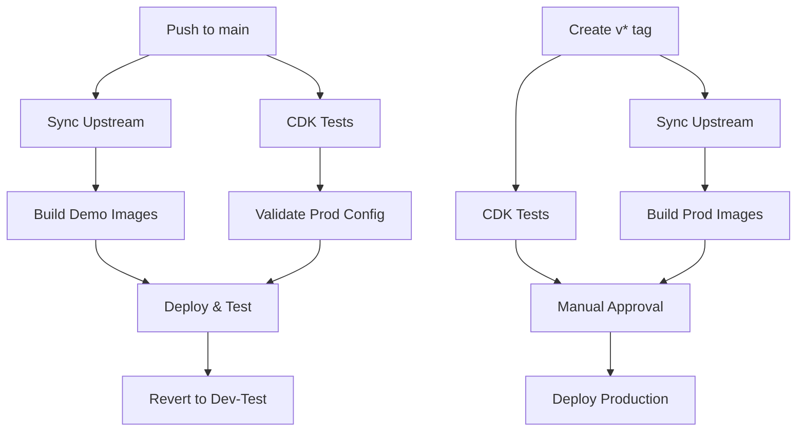

# AWS GitHub Actions Setup for CloudTAK

This guide covers setting up GitHub Actions for the CloudTAK repository, building on the base infrastructure already configured in BaseInfra.

## Prerequisites

**⚠️ Important:** Steps 1-2 from the [BaseInfra AWS GitHub Setup](https://github.com/TAK-NZ/base-infra/blob/main/docs/AWS_GITHUB_SETUP.md) must be completed first:
- Route 53 DNS setup
- GitHub OIDC Identity Provider and IAM roles

> **Note:** The organization variables and secrets configured in BaseInfra will be used for both environments.

## 3. GitHub Environment Setup for CloudTAK

### 3.1 Create Environments

In your CloudTAK GitHub repository, go to **Settings → Environments** and create:

1. **`production`** environment
   - **Protection rules:**
     - Required reviewers: Add team leads
     - Wait timer: 5 minutes
     - Deployment branches and tags: Select "Selected branches and tags"
       - Add rule: "v*" (for version tags like v1.0.0)

2. **`demo`** environment
   - **Protection rules:**
     - Deployment branches and tags: Select "Selected branches and tags"
       - Add rule: "main"

## 4. Branch Protection Setup

**Configure branch protection for `main`** to ensure only tested code is deployed:

1. Go to **Settings → Branches → Add rule**
2. **Branch name pattern**: `main`
3. **Enable these protections:**
   - ☑️ Require a pull request before merging
   - ☑️ Require status checks to pass before merging
     - ☑️ Require branches to be up to date before merging
     - ☑️ Status checks: Select "Test CDK code" after first workflow run

## 5. Breaking Change Detection for CloudTAK

### 5.1 CloudTAK-Specific Breaking Changes

**Critical resources that trigger breaking change detection:**
- PostgreSQL database cluster replacements
- API Gateway replacements
- Application Load Balancer replacements
- Secrets Manager secret deletions
- ECS service configuration changes

### 5.2 Implementation

CloudTAK uses the same breaking change detection system as BaseInfra:

1. **Stage 1 (PR Level)**: CDK diff analysis during pull requests - fast feedback
2. **Stage 2 (Deploy Level)**: CloudFormation change set validation before demo deployment - comprehensive validation

### 5.3 Override Mechanism

See [BaseInfra's override mechanism](https://github.com/TAK-NZ/base-infra/blob/main/docs/AWS_GITHUB_SETUP.md#54-override-mechanism)
(`[force-deploy]` in the commit message) - identical here.

## 6. GitHub Actions Workflows

### 6.1 Workflow Architecture



### 6.2 Demo Testing Workflow (`demo-deploy.yml`)

**Triggers:**
- Push to `main` branch
- Manual dispatch

**Jobs:**
1. **test**: Run CDK unit tests and linting
2. **build-images**: Sync upstream, apply branding, build CloudTAK images
3. **validate-prod**: Validate production configuration
4. **deploy-and-test**: Deploy with prod profile and run tests
5. **revert-to-dev-test**: Always revert to dev-test configuration

### 6.3 Production Deployment Workflow (`production-deploy.yml`)

**Triggers:**
- Version tags (`v*`)
- Manual dispatch

**Jobs:**
1. **test**: Run CDK unit tests
2. **build-images**: Sync upstream, apply branding, build production images
3. **deploy-production**: Deploy to production with built images (requires approval)

### 6.4 Upstream Sync (manual, not a workflow)

Syncing from upstream is **not** automated. Run `scripts/sync-upstream.sh`
locally when you intend to take a new upstream release, then open a PR from the
branch it creates. See [`UPSTREAM-SYNC.md`](UPSTREAM-SYNC.md) for the runbook.

A scheduled `weekly-sync.yml` workflow used to exist. It was removed: every sync
needs real work on our side regardless of how clean the merge is, so an automated
attempt bought nothing, and it held `contents: write` over `vendor/upstream` —
the branch the sync mechanism depends on remaining an ancestor of `main`.

**Note:** branding is applied at build time, not during sync, so `main` carries
upstream code plus our own changes and nothing branding-specific.

### 6.5 Image Building with Conditional Branding

**Build Process:**
1. Checkout clean upstream code from main branch
2. Apply TAK.NZ branding (if `APPLY_BRANDING=true`)
3. Build Docker images with applied branding
4. Push branded images to ECR

**Branding Control:**
- `APPLY_BRANDING=true` - Build with TAK.NZ branding applied
- `APPLY_BRANDING=false` - Build with clean upstream code
- Allows testing both branded and unbranded versions

## 7. Required Secrets and Variables

### 7.1 Organization Secrets and Variables

The core organization secrets (`DEMO_AWS_ACCOUNT_ID`, `DEMO_AWS_ROLE_ARN`, `DEMO_AWS_REGION`,
`PROD_AWS_ACCOUNT_ID`, `PROD_AWS_ROLE_ARN`, `PROD_AWS_REGION`) and variables (`DEMO_STACK_NAME`,
`DEMO_TEST_DURATION`, `DEMO_R53_ZONE_NAME`) are configured once at the organization level in
[BaseInfra's setup guide](https://github.com/TAK-NZ/base-infra/blob/main/docs/AWS_GITHUB_SETUP.md#3-github-organization-setup-one-time-configuration)
and used by every layer, including this one.

### 7.2 Repository Variables

| Variable | Description | Values | Usage |
|----------|-------------|--------|-------|
| `APPLY_BRANDING` | Controls whether TAK.NZ branding is applied during image builds | `true`, `false` | `true` = apply branding at build time, `false` = build with upstream code only |

`SYNC_MODE` used to gate the scheduled upstream sync. Both the variable and the
workflow are gone — syncing is manual, see section 6.4.

## 8. Composite Actions

Location: `.github/actions/setup-cdk/action.yml`. Same purpose and benefits as
[BaseInfra's composite action](https://github.com/TAK-NZ/base-infra/blob/main/docs/AWS_GITHUB_SETUP.md#8-composite-actions) -
consolidates checkout, Node.js setup, AWS credentials, and dependency installation into one step.

## 9. Verification

Test the CloudTAK setup:

1. **Demo Testing:** Push to `main` branch → Should sync upstream → Build images → Deploy demo → Test → Revert
2. **Production:** Create and push version tag:
   ```
   git tag v1.0.0
   git push origin v1.0.0
   ```
   → Should require approval → Deploy after approval

### 9.1 Deployment Flow

**Main Branch Push:**
```
Push to main → Tests → Demo (prod profile) → Wait → Tests → Demo (dev-test profile)
```

**Version Tag Push:**
```
Tag v* → Tests → Production (prod profile) [requires approval]
```

**Benefits:**
- Cost optimization: Demo runs dev-test profile between deployments
- Risk mitigation: Both profiles tested in demo before production
- Separation: Independent workflows for demo testing vs production deployment

## 10. Troubleshooting

### 10.1 Common Workflow Issues

Generic workflow issues (missing secrets/variables, breaking-change validation, image build
failures, CDK synthesis errors, deployment timeouts, composite action errors) and their solutions
are covered in
[BaseInfra's troubleshooting table](https://github.com/TAK-NZ/base-infra/blob/main/docs/AWS_GITHUB_SETUP.md#10-troubleshooting) -
identical here.

### 10.2 CloudTAK Specific Issues

**Common CloudTAK Problems:**

- **Upstream Conflicts:** Resolve conflicts between upstream changes and TAK.NZ customizations
- **Branding Issues:** Verify branding files exist and are compatible with upstream changes
- **API Changes:** Check for breaking changes in upstream API that affect ETL tasks
- **Database Schema:** Verify database migrations are compatible with upstream changes
- **Image Build Failures:** Check Docker build logs for specific errors
- **ETL Task Failures:** Verify the ECS task definitions and container configurations

**Troubleshooting Steps:**

1. Check CloudTAK version in cdk.json
2. Verify stack status in CloudFormation console
3. Review stack events for specific error messages
4. Confirm ECR images are built and tagged correctly
5. Test database connectivity through AWS console
6. Check ECS service logs for container startup issues
7. Verify API Gateway endpoints and configurations

### 10.3 Dependencies on BaseInfra, AuthInfra, and TakInfra

**Required BaseInfra Resources:**
- VPC and networking (subnets, security groups)
- ECS cluster and service discovery
- KMS keys for encryption
- Route 53 hosted zones
- S3 buckets for CDK assets and data storage
- ECR repositories

**Required AuthInfra Resources:**
- PostgreSQL database cluster
- Application Load Balancer (for OIDC integration)
- Secrets Manager secrets (for database credentials)

**Required TakInfra Resources:**
- TAK server API endpoints
- TAK server data sources

Ensure BaseInfra, AuthInfra, and TakInfra are deployed and stable before deploying CloudTAK changes.